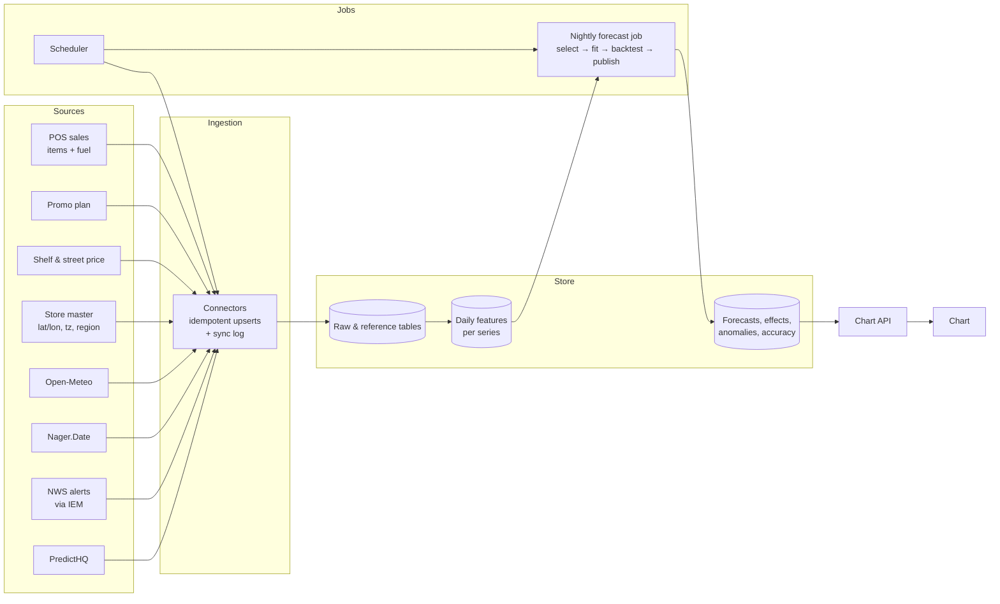

# PRD — Demand Forecast Chart with External Factors

| | |
|---|---|
| **Status** | Draft for review |
| **Date** | 2026-09-30 |
| **Audience** | Backend / data engineering (primary), frontend, product |
| **Scope** | The "Demand — actual vs forecast" chart and everything behind it: data ingestion, forecasting, factor attribution, anomaly detection, and the API the chart reads |
| **Reference implementation** | This repository (Next.js + SQLite prototype). File paths below point to the code that proves each behaviour. The prototype drops sub-0.5% effects instead of returning `other_units` (§11) — the one intentional difference |
| **Target scale** | Up to ~500 stores, a few thousand SKUs per store, forecasts rebuilt nightly |

---

## 1. Summary

The chart shows, for one store and one scope (all inside sales, a category, all fuel, or one fuel grade):

- **Actual** daily demand for the recent past.
- **Forecast** daily demand for the next 7, 14 or 30 days, with 80% and 95% prediction intervals.
- **Anomalies**: past days that were statistically unusual, with a likely cause where one is known.
- **A hover card for every day** that breaks the value into a *baseline* plus the effect of each external factor that day — promotions, price, holidays, weather, weather alerts, local events — in units and percent.

The forecast is not a black box. It **learns each factor's effect from the store's own sales history** and **applies those effects to what is already known about the coming days**: the promotions planned, the weather forecast at the store, upcoming public holidays, active weather alerts, and scheduled local events. Every factor has to prove it improves accuracy on a backtest before it is allowed into a series' forecast.

This PRD specifies what the backend must build so the chart works on real data, at chain scale, without manual work.

---

## 2. Background

The prototype in this repository established that the approach works and what the pitfalls are:

- On Store 101 inside sales, the external-factor model scores **92.1% accuracy (7.9% WAPE)** against **88.8%** for Holt-Winters on sales history alone, on the same backtest (8 two-week windows, 112 days).
- Promotions are the largest single gain (−1.4 points of error). Planned promotions correctly raise the forecast on promo days by about the lift seen historically.
- Adding an input blindly can make the forecast *worse*: real local events added +1.3 points of error to sales that don't respond to them. This is why inputs are selected per series by backtest (§10.6).
- Several data problems only showed up with real feeds: holidays reported as negative effects, school breaks reported as "attendance", price rounding noise producing absurd elasticities, observances ranked by prominence rather than footfall. Each became a requirement below (§16).

> **Note:** prototype sales and promotions are synthetic. The accuracy numbers above demonstrate the machinery, not the value of each factor on real data. On real POS data, expect different factors to matter at different stores — the design handles that automatically.

---

## 3. Goals and non-goals

### Goals

1. Forecast daily demand per store for inside sales (per SKU, per category, store total) and fuel (per grade, total), 1–30 days ahead, refreshed nightly.
2. Use external factors automatically, from APIs, with **no manual data entry**: weather, public holidays, weather alerts, local events.
3. Use internal factors from existing systems: promo calendar, shelf price, fuel street price.
4. Explain every forecast and every past day with a per-factor breakdown that adds up to the number shown.
5. Only use a factor for a series when it measurably improves that series' forecast.
6. Serve the chart from precomputed results: fast, consistent, reproducible.

### Non-goals (this release)

- Replenishment / order recommendations and fuel delivery plans (they consume these forecasts; separate spec).
- Manual event entry UI. Explicitly out: all events come from APIs.
- Intraday (hourly) forecasting.
- Price optimisation or promo planning ("what if I run a promo") — the model supports it, but no scenario API in this release.
- Model types beyond those in §10 (gradient boosting, deep learning). The architecture must allow adding them later (§10.6).

---

## 4. Users and use cases

| User | Question the chart answers | Filters used |
|---|---|---|
| Store manager | "How busy will the next two weeks be, and why?" | Store, horizon |
| Category buyer | "Is Beverages demand going up next week, and is that the promo or the heat?" | Store, category, horizon |
| Fuel operations | "How many gallons will each grade pump, and is the price change driving it?" | Store, grade, horizon |
| Analyst | "Why was last Tuesday 30% down?" | Anomaly markers + hover card |

---

## 5. What the chart shows

### 5.1 Controls

| Control | Values | Default |
|---|---|---|
| Forecast horizon | Next 7 / 14 / 30 days | 14 |
| Store | Every store in the store master | First store |
| Scope — inside | All categories, or one category | All categories |
| Scope — fuel | All grades, or one grade | All grades |

Changing a control keeps the previous chart on screen, dimmed, until the new data arrives (no blank state after first load).

### 5.2 Series on the chart

| Series | Days | Source |
|---|---|---|
| Actual | The last *H* days of history, where *H* is the selected horizon | Sales |
| Forecast | The next *H* days | Forecast run (§10) |
| 80% and 95% interval | The next *H* days | Forecast run (§10.7) |
| Join point | The last actual day is repeated as the forecast's first point so the two lines meet | API |
| Anomaly marker | Past days flagged by §12 | Anomaly run |

### 5.3 The hover card (one per day)

```
Sat, Sep 26                         58°F · Open-Meteo
● Baseline                                   1,437
● Promotions                     +102      +6.9%
● Wind Advisory                   +50      +3.3%
────────────────────────────────────────────────
— Forecast                                   1,588
  80% range 1,437 – 1,755
Effects the forecast applies, learned from this store's sales
```

Rules (details in §11):

- **Baseline** = what the day would be with every listed factor switched off.
- **Each factor row** shows its effect in units and percent. Baseline + rows = the day's value; effects too small to list (under ±0.5%) are carried in one "other" amount so the sum stays exact.
- Rows under ±0.5% are hidden. Rows are sorted by absolute size.
- The header shows the day's temperature and where it came from: `Open-Meteo`, `Open-Meteo forecast`, or `no reading`.
- The footer states the mode: **"Effects the forecast applies"** when the external-factor model produced the forecast, or **"explanation only"** when the series uses the fallback model and the effects are estimated after the fact.
- An anomaly adds a line: `▲ Spike +32% vs expected · Independence Day travel surge`.

### 5.4 Around the chart (same API response)

- Headline: forecast total over the horizon, 80% range, change vs the prior *H* days.
- Accuracy panel: accuracy (1 − WAPE), MAPE, bias, MASE, which model is in use, both models' backtest scores, and which optional inputs are in use ("Weather alerts ✓ · Local events — left out").
- Data sources panel: each source's last sync, row count, date range, schedule and next run (§7.6).

---

## 6. System overview



Principles:

- **Everything the chart shows is precomputed** by the nightly job and read by the API. The API does no model fitting.
- **Every external source is a connector** with the same contract: fetch → normalise → idempotent upsert → log the run.
- **One feature definition** is shared by training, backtesting, attribution and analysis, so they can never disagree (prototype: `src/lib/forecast/design.ts`).

---

## 7. Data sources and ingestion

### 7.1 Internal sources (required)

| Data | Grain | Required fields | Notes |
|---|---|---|---|
| Item sales | store × SKU × day | units sold | Missing day for an active SKU = 0 units. Must include history back to the store's first sale (up to 2 years used) |
| Fuel sales | store × grade × day | gallons sold, street price | Street price per grade per day |
| Promo plan | SKU (× store if store-specific) × date range | start, end, discount depth (0–1) | **Must include future promos** — this is what lets the forecast raise demand on upcoming promo days |
| Shelf price | store × SKU × day | price index or price | Base price excluding promo discount (§9.1) |
| Store master | store | id, name, latitude, longitude, timezone, region (ISO 3166-2, e.g. `US-NJ`), first sales date | Location drives weather, alerts and events |
| SKU master | SKU | id, name, category | |
| Category, fuel grade masters | | id, name, short name | Display order = entry order |

Ingestion of internal data is by batch file or database replication from the POS / ERP; the exact mechanism is an open question (§19). The contract is the table shapes in §8.

### 7.2 Open-Meteo — weather at each store (no key)

| | |
|---|---|
| History | `GET https://archive-api.open-meteo.com/v1/archive` with `latitude, longitude, timezone, start_date, end_date, daily=temperature_2m_mean,precipitation_sum` |
| Forecast | `GET https://api.open-meteo.com/v1/forecast` with `forecast_days=16, past_days=7` (fills the archive's few-day lag) |
| Normals | Daily mean temperature and rain for the 10 full years before the current year, averaged by day of year, smoothed with a ±7-day circular window. Fetched once per store; refreshed yearly |
| Stored per store-day | temp °F, **temp anomaly** = temp − that location's normal for the day of year, rain mm, kind = `observed` / `forecast` |
| Merge rule | Observed wins over forecast for the same date |
| Cadence | Every 3 hours |
| Horizon limit | 16 days. Days beyond have **no reading and are treated as normal weather** (anomaly 0, rain 0) — never an invented value |

Prototype: `src/lib/external/weather.ts`, `syncWeather` in `src/lib/db/ingest.ts`.

### 7.3 Nager.Date — public holidays (no key)

| | |
|---|---|
| Endpoint | `GET https://date.nager.at/api/v3/PublicHolidays/{year}/US` for each year from the earliest sales year to next year |
| Keep | `global = true` (national) → region `US`; otherwise keep only if `counties` contains a store's region (e.g. Good Friday in `US-NJ`) |
| Kind | `public` if `types` contains `Public`, else `observance`. **Only `public` enters the model** |
| Cadence | Weekly |
| Known behaviour | Dates are the *observed* date — e.g. Independence Day 2026 is listed as **Jul 3** (Jul 4 is a Saturday) |

### 7.4 National Weather Service — weather alerts (no key)

| | |
|---|---|
| Endpoint | Iowa Environmental Mesonet archive of NWS VTEC products: `GET https://mesonet.agron.iastate.edu/json/vtec_events_bypoint.py?lat&lon&sdate&edate` |
| Window | Store's first sales date − 2 days → today + 7 days (alerts are issued at most a few days ahead) |
| Keep | Significance `W` (warning) or `Y` (advisory). Drop `A` (watch) |
| Classify | By phenomena code into `winter`, `heat`, `storm` (Appendix A). Drop unmapped codes (fog, frost, coastal flood, fire weather) |
| De-duplicate | One product covers several zones: key = `wfo-year-phenomena.significance-eventid`; merge date ranges |
| Dates | Convert UTC issue/expire to the **store's local date** |
| Cadence | Every 30 minutes |

Prototype: `src/lib/external/nws.ts`, `syncAlerts`.

### 7.5 PredictHQ — local events (API key)

| | |
|---|---|
| Endpoint | `GET https://api.predicthq.com/v1/events/` with `within={10}km@{lat},{lon}`, `active.gte`, `active.lte`, `active.tz={store tz}`, `category=…`, `sort=start`, `limit=200`, follow `next` for pagination |
| Auth | `Authorization: Bearer {PREDICTHQ_API_TOKEN}` — from a secrets manager, never in code or logs |
| Window | Store's first sales date → today + 90 days |
| Categories fetched | `concerts, festivals, sports, performing-arts, community, expos, conferences, school-holidays, severe-weather` |
| Not fetched | `observances` — PredictHQ ranks them by general prominence (e.g. "Gold Star Mother's Day" = rank 90), not footfall |
| Fields | id, title, category, start/end (use `start_local`/`end_local` dates), `phq_attendance`, rank, local_rank, location (GeoJSON `[lon, lat]`) → distance to store |
| Replace, don't append | Each sync **replaces the store's rows**, so cancelled events and dropped categories disappear |
| Cadence | Every 12 hours |
| Errors | 401 → token rejected; 402/403 → plan doesn't allow request; 429 → rate limited. All logged, retried per §7.6 |

How the categories are used (§9.1):

- **Crowd categories** (concerts … conferences): `phq_attendance` is people at the event.
- **School holidays**: `phq_attendance` is **enrolment**, not attendance — used as an on/off flag only.
- **Severe weather**: merged into the storm alert flag.

Prototype: `src/lib/external/predicthq.ts`, `syncEvents`.

### 7.6 Scheduling, idempotency and observability

| Source | Cadence | Retry after failure |
|---|---|---|
| NWS alerts | 30 min | 15 min |
| Open-Meteo | 3 h | 15 min |
| PredictHQ | 12 h | 15 min |
| Nager.Date | weekly | 15 min |
| Internal sales / promos / prices | nightly, before the forecast job | per pipeline SLA (§14) |

Requirements:

1. **Idempotent**: every connector upserts on natural keys; re-running never duplicates.
2. **Sync log** per run: source, started/finished, rows, date range, status, error text.
3. **Due-time scheduling from the log**, not from process uptime — a restart catches up on overdue sources instead of re-syncing everything.
4. **One run per source at a time** — manual "Sync now" and scheduled runs share a lock.
5. **Manual trigger** endpoint per source (admin only) — §13.4.
6. A source whose key is missing reports `needs-key` and is skipped, not failed.
7. Staggered starts when several sources are due together.
8. Alert when a source hasn't synced successfully for 2× its cadence.

Prototype: `src/lib/sync/auto.ts` (runs inside the web server — production should use a real job scheduler; see §14).

---

## 8. Data model

Stack-agnostic; types are indicative. `(PK)` = primary key.

### Reference

```sql
stores        (id PK, name, format, latitude, longitude, timezone, region, history_start)
categories    (id PK, name, short_name, sort_order)
skus          (id PK, name, category_id FK, unit_cost, unit_price, case_size, lead_time_days, shelf_life_days)
fuel_grades   (id PK, name, short_name, octane, tank_gallons, reserve_fraction, margin_per_gallon, sort_order)
```

### Internal facts

```sql
item_sales    (store_id, sku_id, date, units_sold, price_index, on_promo, discount)      PK (store_id, sku_id, date)
fuel_sales    (store_id, grade_id, date, gallons_sold, street_price)                    PK (store_id, grade_id, date)
promotions    (sku_id, store_id NULL = all stores, start_date, end_date, discount)      PK (sku_id, store_id, start_date)
```

### External facts

```sql
store_weather         (store_id, date, temp_f, temp_anomaly, precip_mm, kind, source, fetched_at)  PK (store_id, date)
store_weather_normals (store_id, doy, temp_f, precip_mm, years)                                    PK (store_id, doy)
holidays              (date, name, region, kind, source)                                           PK (date, name, region)
external_events       (source, id, store_id, title, category, start_date, end_date,
                       attendance, rank, local_rank, distance_km, fetched_at)                      PK (source, id, store_id)
sync_log              (id PK, source, started_at, finished_at, rows, date_from, date_to, status, error)
```

`external_events` holds both NWS alerts (`source='nws'`, `category` = `alert-winter|alert-heat|alert-storm`) and PredictHQ events (`source='predicthq'`).

### Model outputs (written by the nightly job, read by the API)

```sql
forecast_runs     (run_id PK, started_at, finished_at, as_of_date, code_version, status)

series            (series_id PK, store_id, stream  -- 'items' | 'fuel'
                   , level                          -- 'sku' | 'category' | 'store' | 'grade' | 'fuel-total'
                   , key)                           -- sku_id, category_id, grade_id or 'all'

series_model      (run_id, series_id, model         -- 'driver' | 'holt-winters'
                   , inputs_used                    -- e.g. {"weather":false,"alerts":true,"events":false}
                   , driver_wape, hw_wape, wape, mape, bias, mase, naive_wape, backtest_points
                   , coefficients JSON)             PK (run_id, series_id)

forecast_points   (run_id, series_id, date, h, mean, lo80, hi80, lo95, hi95)               PK (run_id, series_id, date)

daily_effects     (run_id, series_id, date, baseline, value, mode  -- 'model' | 'explanation'
                   , rows JSON, other_units)        PK (run_id, series_id, date)
                   -- rows: [{id, type, label, pct, units}], covers the last 30 history days and all forecast days

anomalies         (run_id, series_id, date, actual, expected, z, direction, deviation, severity,
                   cause_label, context_labels JSON)                                       PK (run_id, series_id, date)
```

Retention: keep the last 30 runs; keep one run per week for a year for accuracy tracking.

---

## 9. Feature engineering

Every series gets one feature row per day, covering its full history **and** the forecast window (up to 60 days ahead). The same function produces training features and forecast features.

### 9.1 Feature definitions

| Group | Column | Definition | Future values |
|---|---|---|---|
| Trend | `trend` | days since series start ÷ 365 | extrapolated |
| Season | `year_sin1, year_cos1, year_sin2, year_cos2` | sin/cos(2πk·doy/365), k = 1, 2 | calendar |
| Weekday | `dow_1 … dow_6` | 1 if Mon…Sat (Sunday = reference) | calendar |
| Promotions | `promo` | SKU: 1 on promo. Aggregate: volume-weighted share of SKUs on promo | **from the promo plan** |
| | `discount` | SKU: discount depth. Aggregate: volume-weighted | promo plan |
| Price | `log_price` | Items: log of **shelf** price index — price ÷ (1 − discount), **snapped to whole-percent steps**. Fuel: log(street price ÷ trailing 90-day mean) | held at last observed level |
| Holidays | `holiday` | 1 on a public holiday (national or store's region) | calendar |
| | `pre_holiday` | 1 on the day before a public holiday | calendar |
| Weather | `temp_anom` | °F vs the store's normal | forecast ≤16 days, else 0 |
| | `rain` | log1p(mm) | forecast ≤16 days, else 0 |
| Alerts | `alert_winter`, `alert_heat`, `alert_storm` | 1 while an alert of that kind is in force (storm also set by PredictHQ severe-weather) | only alerts already issued |
| Local events | `local_attendance` | log1p(Σ daily attendance ÷ 1000) over crowd events active that day; a multi-day event's attendance is spread evenly over its days | scheduled events |
| | `school_break` | 1 if any nearby school district is on break | scheduled breaks |

Aggregate series (category, store total, total fuel) weight per-SKU/grade columns by each member's share of volume over the last 90 days.

### 9.2 Why the price rules exist

- **Discount removed from price**: the discount already enters through `discount`; leaving it in the price counts every promo twice and blurs both effects.
- **Snapped to 1% steps**: stored price index and discount are each rounded, so dividing leaves ±0.1% noise. A store whose only "price change" is that noise earned a coefficient of **+509% per 1%** in the prototype.

---

## 10. Forecasting

### 10.1 Which series are forecast

Per store, every night:

- Inside: each SKU; each category; the store total.
- Fuel: each grade; the total.

Aggregates are **fitted as their own series**, not as sums of member forecasts: summing member interval endpoints assumes every SKU misses in the same direction on the same day, which overstates the band. (The aggregate point forecast is also refit, so the headline number and its band come from one model.)

Scale: ~500 stores × (~3,000 SKUs + ~10 categories + 1 total + ~5 fuel series) ≈ **1.5 million series per night**. See §14 for compute.

### 10.2 Driver model (the external-factor model)

- Target: `z = log1p(demand)`. Multiplicative effects; forecasts never negative. Back-transform `expm1` gives a **median**, the right number to stock against for right-skewed demand.
- Ridge regression on standardised columns; λ = 2.5; standardise on the training range only; drop constant columns.
- **Sign constraint**: if `log_price`'s coefficient comes out > 0, drop the column and refit. Raising price never raises demand; a positive fit means the column is borrowing a coincident trend. (Extendable to other signed columns.)
- Minimum rows: columns + 10; otherwise the series has no driver model.

### 10.3 Recent-level correction

Inputs never explain everything (a competitor opening, a slow drift). The in-sample residuals of the regression are exponentially smoothed; the last level `L` is carried into the forecast and decays:

```
forecast_log(t+h) = ridge_prediction(t+h) + L · 0.9^h
```

The smoothing weight α ∈ {0, 0.05, 0.1, 0.2, 0.35} is chosen per series by how well `L · 0.9^7` predicts the residual 7 days later (α = 0 means no correction).

### 10.4 Holt-Winters (fallback / benchmark)

Damped-trend Holt-Winters with weekly seasonality on `log1p(demand)`; parameters by grid search on one-step SSE: α ∈ {0.04, 0.08, 0.14, 0.22, 0.32, 0.45}, β ∈ {0, 0.02, 0.06, 0.12}, γ ∈ {0.02, 0.06, 0.12, 0.22, 0.35}, φ = 0.94. Deterministic: the same series always yields the same parameters.

### 10.5 Backtest protocol (shared by every decision below)

- Rolling origin, **8 origins, 14 days apart**, horizon `H = max(requested horizon, 14)`; the last window ends on the last day of history.
- Short series get fewer origins (never fewer than 2) instead of none. Minimum training before the first origin: 42 days. Both models are scored on **identical origins**.
- Forecasts at each origin use only data before that origin.
- Holt-Winters parameters are fitted once on the first training window and held fixed as the origin walks forward.
- Metrics: **WAPE** (headline; robust to zero-demand days), MAPE (non-zero days only), bias (signed error ÷ actual), MASE vs seasonal naive (same weekday last week), point count.

Known foresight in backtests (documented, acceptable): weather uses observed temperature and alerts use all alerts issued; live forecasts only have the weather forecast and alerts issued so far. Treat backtested weather/alert gains as upper bounds.

### 10.6 Input selection and model selection (per series)

1. **Core inputs** are always in the driver model: trend, season, weekday, promotions, price, holidays.
2. **Optional inputs** — `weather`, `alerts`, `events` — must earn their place by **forward selection** on the backtest: start with core; add whichever optional group lowers WAPE most; repeat until no group improves WAPE by at least **0.1 point**.
3. **Model selection**: use the driver model with the selected inputs if its backtest WAPE is lower than Holt-Winters'; otherwise Holt-Winters.
4. A series too short to backtest uses Holt-Winters and is reported as "not scored yet".
5. Store the choice, the inputs used, both scores and the coefficients (`series_model`).

Cost control: input selection is the expensive step (up to 7 backtests per series). Run it **weekly**; nightly runs reuse the stored selection and only refit coefficients and forecast. Re-run selection for a series immediately if its nightly error drifts > 3 points above its backtest WAPE.

### 10.7 Prediction intervals

From the chosen model's own backtest errors, not a formula:

1. Per horizon step h, variance of log errors across origins.
2. Fit `var(h) = a + b·h` by least squares (error variance grows roughly linearly with horizon); floor at half the smallest observed variance.
3. `lo/hi = expm1(log1p(mean) ∓ z·σ(h))`, z = 1.2816 (80%) and 1.96 (95%).

Intervals are therefore asymmetric in units (wider above than below), as count data should be.

### 10.8 Rules for the known future

| Input | Where future values come from |
|---|---|
| Promotions | The promo plan. A promo not in the plan is not forecast |
| Price | Held at the last observed level |
| Holidays | Nager.Date calendar |
| Weather | Open-Meteo forecast for days 1–16; normal (0) beyond |
| Alerts | Only alerts already issued; none assumed beyond |
| Local events | PredictHQ events already scheduled |

---

## 11. Factor attribution (the hover card)

For every chart day (last 30 history days + all forecast days), per series:

1. **Effects source**: if the series uses the driver model, take its fitted coefficients — `mode = "model"`. If it uses Holt-Winters, fit the same design on all history purely for explanation — `mode = "explanation"`.
2. **Log effect per factor**, each against that factor being *off* (no promo, no holiday, normal weather and no rain, price at reference, no alert, no event):

   | Row type | Log effect |
   |---|---|
   | `promo` | β_promo·promo + β_discount·discount |
   | `price` | β_log_price·log_price |
   | `holiday` | β_holiday·holiday + β_pre·pre_holiday |
   | `weather` | β_temp·temp_anom + β_rain·rain |
   | `alert` | Σ β_alert_k·alert_k |
   | `local` | β_attendance·local_attendance |
   | `school` | β_school·school_break |
   | `level` | recent-level correction L·0.9^h (forecast days, driver model only) |

3. `baseline = value / exp(Σ effects)` where `value` = actual (history) or forecast mean (future).
4. `units_i = (value − baseline) · effect_i / Σ effects` — baseline + rows adds up to the value exactly.
5. `pct_i = expm1(effect_i)`.
6. Rows with |pct| < 0.5% are not listed; their units are summed into `other_units`, so `baseline + Σ rows.units + other_units = value` exactly. Sort listed rows by |pct| descending.
7. Labels come from the source data:

   | Row | Label |
   |---|---|
   | weather | `Weather +14°F vs normal · 11 mm rain` (rain shown when ≥ 1 mm) |
   | holiday | holiday name, or `Eve of {holiday}` |
   | alert | first alert name in force (NWS or PredictHQ severe weather), `+N more` |
   | local | largest event title with attendance, e.g. `Horsepower Harvest Fall Car Show (1.3K) +2 more` |
   | school | `School break · {district}` `+N more` |
   | level | `Recent-level adjustment` |

8. Header: temperature °F and `weatherSource` (`observed` / `forecast` / `none`).

The separate "What's driving the forecast" card uses the same coefficients aggregated over the forecast window vs the historical average, with a fixed, disclosed bridge order (trend → season → weekday → promo → holiday → weather → price → alerts → events).

---

## 12. Anomaly detection

- Score each history day by the robust z-score of Holt-Winters' one-step log residual: `z = (r − median) / (1.4826 · MAD)`, skipping a 28-day warm-up.
- Flag |z| ≥ 3. Severity: ≥ 5 critical, ≥ 4 serious, else warning. Direction: spike / drop. Deviation = (actual − expected) ÷ expected.
- Name a **likely cause** by date overlap with API events: every NWS alert and PredictHQ severe weather; PredictHQ crowd events with attendance ≥ 1,000. Events longer than 30 days are *context*, not causes. Shortest event first.
- The detector never reads the events — it finds outliers statistically; the join only names them. A day with no match says "no logged event".
- Consecutive flagged days (gap ≤ 2) group into one incident for the anomaly list.

---

## 13. API contract

All read endpoints serve the latest successful `forecast_run`. Responses include `run_id` and `as_of` so the UI can show freshness and caches can key on them.

### 13.1 `GET /v1/forecast-chart`

| Param | Type | Required | Values |
|---|---|---|---|
| `store_id` | string | yes | store id |
| `stream` | string | yes | `items` \| `fuel` |
| `scope` | string | no | `all` (default), a category id (items) or grade id (fuel) |
| `horizon` | int | no | `7` \| `14` (default) \| `30` |

Response (abridged, real values from the prototype):

```json
{
  "run_id": "2026-09-26T03:00Z",
  "as_of": "2026-09-26",
  "store": { "id": "s-101", "name": "Store 101 — Route 9 Travel Center" },
  "scope": { "stream": "items", "key": "all", "label": "All categories" },
  "unit": "units",
  "horizon": 14,
  "summary": {
    "horizon_total": 20106, "horizon_lo80": 17684, "horizon_hi80": 22866,
    "prior_total": 22480, "delta_vs_prior": -0.106
  },
  "model": {
    "used": "driver",
    "inputs": { "weather": false, "alerts": true, "events": false },
    "accuracy": { "wape": 0.0785, "mape": 0.0767, "bias": 0.0176, "mase": 0.716, "points": 112 },
    "candidates": { "driver_wape": 0.0785, "hw_wape": 0.1115 },
    "series_on_driver": 43, "series_total": 43
  },
  "rows": [
    {
      "date": "2026-09-13", "actual": 1593, "mean": null,
      "lo80": null, "hi80": null, "lo95": null, "hi95": null,
      "anomaly": null,
      "factors": {
        "temp_f": 73.6, "temp_anomaly": 4.3, "precip_mm": 14, "weather_source": "observed",
        "baseline": 1405, "mode": "model", "other_units": 0,
        "rows": [
          { "id": "promo", "type": "promo", "label": "Promotions", "pct": 0.097, "units": 139 },
          { "id": "alert", "type": "alert", "label": "Flood", "pct": 0.033, "units": 49 }
        ]
      }
    },
    {
      "date": "2026-09-26", "actual": null, "mean": 1588,
      "lo80": 1437, "hi80": 1755, "lo95": 1363, "hi95": 1851,
      "anomaly": null,
      "factors": {
        "temp_f": 57.9, "temp_anomaly": -7.8, "precip_mm": 30.9, "weather_source": "observed",
        "baseline": 1437, "mode": "model", "other_units": 0,
        "rows": [
          { "id": "promo", "type": "promo", "label": "Promotions", "pct": 0.069, "units": 102 },
          { "id": "alert", "type": "alert", "label": "Wind Advisory", "pct": 0.033, "units": 50 }
        ]
      }
    }
  ]
}
```

Field rules:

- `rows` = last `horizon` history days + `horizon` forecast days, ascending by date. The last history row also carries `mean/lo/hi` = its actual (join point).
- `anomaly`: `{ direction, severity, deviation, cause }` or `null`.
- Numbers are unrounded in the API; the UI formats.
- `weather_source` ∈ `observed | forecast | none`; `mode` ∈ `model | explanation`.

Errors: `400` invalid params (message names the param); `404` unknown store/scope; `503` no successful run yet (body: last run status).

Performance: p95 < 300 ms. Response ≤ 100 KB. Cache by `(run_id, params)`; invalidate on new run.

### 13.2 `GET /v1/forecast-meta`

Stores (id, name, history_start), categories, fuel grades, horizons, `as_of`. Drives the filter menus.

### 13.3 `GET /v1/data-sources`

Per source: id, label, configured (key present), status (`ok | error | never | needs-key`), last sync, rows, date range, last error, schedule, next run, running.

### 13.4 `POST /v1/data-sources/{source}/sync` (admin)

Runs one source now through the shared lock. `200` result; `409` already running; `400` missing key.

---

## 14. Nightly pipeline, SLAs and compute

| Time (store local, ET) | Step |
|---|---|
| by 02:00 | Previous day's sales, promo plan changes and prices landed |
| 02:00 | Freshness gate: sales for every active store present, external sources synced within 2× cadence. Missing store → forecast it with last good data and flag it |
| 02:05 | Build features for all series |
| 02:15 | Fit + forecast + backtest (nightly: reuse selection). Weekly (Sunday): full input selection |
| 04:30 | Attribution rows, anomalies, accuracy |
| 05:00 | Publish run atomically (switch the "latest run" pointer only when every step succeeded) |
| 06:00 | **SLA**: charts show today's run |

Compute estimate (to validate in a spike): a ridge fit on ~730 × ~26 is sub-millisecond in a vectorised language. Nightly ≈ 1.5M series × ~10 fits (backtest + final) ≈ 15M fits; weekly selection ≈ 1.5M × ~50 fits. Both are embarrassingly parallel by store — size workers so the weekly job finishes inside the window.

Suggested architecture (not mandated): Postgres for tables; a Python (NumPy) forecasting service for the job; a workflow scheduler (e.g. Airflow, Dagster, cloud-native cron) for connectors and the nightly DAG; the web app reads through the API. The prototype runs the scheduler inside the web server; production must not.

---

## 15. Non-functional requirements

- **Reproducibility**: a run is identified by `run_id` + code version; re-running on the same inputs yields identical numbers (all model choices are deterministic grids).
- **Timezones**: all dates are store-local calendar dates; convert API timestamps (NWS UTC, PredictHQ local) at ingestion.
- **Security**: API keys in a secrets manager, rotated; never logged. PredictHQ token must not reach the browser.
- **Observability**: per-run metrics (series count, share on driver model, median WAPE, failures); per-source freshness; alert on stale sources, failed runs, and WAPE drift.
- **Accuracy tracking**: every day, score yesterday's forecasts against actuals; trend per store/category.
- **Rate limits**: respect provider limits; PredictHQ sync paginates and backs off on 429.
- **Graceful degradation**: any external source down → forecasts still publish, using the last synced data; the affected input is treated as "off" for days without data; the data-sources panel shows the stale source.

---

## 16. Edge cases and rules learned in the prototype

| # | Case | Rule |
|---|---|---|
| 1 | Holiday "weights" gave negative effects | Holidays are 0/1 flags; the model learns the effect |
| 2 | School holidays report enrolment as "attendance" | School breaks are a separate 0/1 input |
| 3 | PredictHQ observances ranked by prominence | Not fetched |
| 4 | Price rounding noise → +509% elasticity | Shelf price snapped to 1% steps |
| 5 | Price fitted with the wrong sign | Non-positive constraint; drop and refit |
| 6 | Discount counted twice (price + promo) | Price excludes promo discount |
| 7 | A months-long event named as the cause of every anomaly in its window | Events > 30 days are context, not causes |
| 8 | Real events made demo forecasts worse | Per-series forward selection on the backtest |
| 9 | Weather beyond 16 days | Treated as normal, flagged `weather_source: none` |
| 10 | Store with 90 days of history | Fewer backtest origins; below 2 origins → Holt-Winters, "not scored yet" |
| 11 | Store opened recently — SKU never sold | Excluded from the store's range |
| 12 | Nager lists observed dates (Jul 3 for Jul 4) | Accept as-is; document |
| 13 | Alert with no NWS name (PredictHQ severe weather) | Label from the PredictHQ title |
| 14 | Cancelled PredictHQ events | Replace-per-store sync removes them |
| 15 | A manual sync overlapping a scheduled one | Shared per-source lock |
| 16 | Hand-entered events | Out of scope; the forecast uses API data only |

---

## 17. Acceptance criteria

1. For every chart row, `baseline + Σ rows.units + other_units` equals `actual` (history) or `mean` (forecast) to within rounding.
2. For every forecast row, `lo95 ≤ lo80 ≤ mean ≤ hi80 ≤ hi95`, and interval width is non-decreasing with h.
3. A SKU with a planned promo inside the horizon has a higher forecast on promo days than on comparable non-promo days (same weekday), by roughly its historical promo lift.
4. `series_model` shows the driver model only where its backtest WAPE < Holt-Winters'; optional inputs appear only where they lowered WAPE by ≥ 0.1 point.
5. No `log_price` coefficient > 0 in any stored model.
6. Removing an API key or blocking a source for a day: forecasts still publish by 06:00; the source shows `error`/`needs-key`; no chart breaks.
7. Re-running a night's job on the same inputs reproduces every number exactly.
8. `GET /v1/forecast-chart` p95 < 300 ms at 50 concurrent users.
9. A golden test suite reproduces the prototype's Store 101 results on the prototype dataset: Holt-Winters 88.8%, driver 92.1% (8 origins, H = 14).

---

## 18. Rollout

| Phase | Deliverable |
|---|---|
| 0 — Spike (1 wk) | Port the model to the target stack; reproduce §17.9; measure compute per series |
| 1 — Data | Internal ingestion + the four connectors + sync log + scheduler; data-sources endpoint |
| 2 — Forecast | Nightly job: features, driver + Holt-Winters, backtest, selection, intervals; outputs tables |
| 3 — Explain | Attribution rows, anomalies, driver card aggregates |
| 4 — API + pilot | Chart API; pilot 10 stores for 4 weeks; compare live accuracy vs backtest |
| 5 — Scale | All stores; monitoring, alerting, accuracy tracking dashboards |

---

## 19. Open questions

| # | Question | Owner |
|---|---|---|
| 1 | How do POS sales, promo plans and prices arrive (files, DB replication, API)? Latency? | Data eng + retail systems |
| 2 | Are promos chain-wide or store-specific? Do we get promo *type* (BOGO, % off, display)? | Merchandising |
| 3 | Store coordinates, timezone and region for every store — source of truth? | Store ops |
| 4 | PredictHQ plan limits (history depth, calls/day) at 500 stores? Budget? | Product |
| 5 | Intermittent SKUs (many zero days): the log-linear model is weak there. Add a Croston/TSB model as a third candidate? | Data science |
| 6 | Should the event radius (10 km) vary by store format (highway vs urban)? | Data science |
| 7 | Stockouts: zero sales on a stockout day is not zero demand. Do we get out-of-stock flags to exclude or correct those days? | Retail systems |
| 8 | Holidays beyond Nager's public list (Super Bowl Sunday, Halloween, Mother's Day) — add a curated observance list, or rely on events? | Product |
| 9 | Retention and audit requirements for forecasts? | Compliance |

---

## Appendix A — NWS phenomena mapping

| Kind | VTEC phenomena codes |
|---|---|
| winter | WS (winter storm), BZ (blizzard), IS (ice storm), WW (winter weather), LE (lake-effect snow), SQ (snow squall), WC (wind chill), EC (extreme cold), CW (cold weather) |
| heat | HT (heat), EH (excessive heat), XH (extreme heat) |
| storm | SV (severe thunderstorm), TO (tornado), FF (flash flood), FA (areal flood), FL (flood), HW (high wind), WI (wind), TR (tropical storm), HU (hurricane), SS (storm surge) |
| dropped | everything else (FG fog, FR frost, FZ freeze, CF coastal flood, FW fire weather, …) |

Significance kept: `W` warning, `Y` advisory. Dropped: `A` watch.

## Appendix B — Constants

| Constant | Value | Where |
|---|---|---|
| Ridge λ | 2.5 | design.ts |
| Level-correction decay φ | 0.9 / day | driver-forecast.ts |
| Level-correction α grid | 0, 0.05, 0.1, 0.2, 0.35 | driver-forecast.ts |
| α tuning lead | 7 days | driver-forecast.ts |
| Min training before first origin | 42 days, both models | driver-forecast.ts |
| Backtest | 8 origins × 14 days, H = max(horizon, 14) | backtest.ts |
| Selection min gain | 0.1 WAPE point | driver-forecast.ts |
| Holt-Winters damping φ | 0.94 | holt-winters.ts |
| Interval z | 1.2816 (80%), 1.96 (95%) | driver-forecast.ts |
| Tooltip min effect | 0.5% | factors.ts |
| Anomaly threshold | robust z ≥ 3 (≥4 serious, ≥5 critical), 28-day warm-up | anomalies.ts |
| Nameable event | attendance ≥ 1,000 | repository.ts |
| Structural event | > 30 days | events.ts |
| Event radius / lookahead | 10 km / 90 days | ingest.ts |
| Alert lookahead | 7 days | ingest.ts |
| Weather forecast | 16 days (+7 past) | weather.ts |
| Normals | 10 full years, ±7-day smoothing | weather.ts |
| Known-future calendar | 60 days | repository.ts |
| Sync cadences | alerts 30 min, weather 3 h, events 12 h, holidays 7 d; retry 15 min | sync/auto.ts |

## Appendix C — Prototype code map

| Concern | File |
|---|---|
| Feature design, ridge, sign constraint | `src/lib/forecast/design.ts` |
| Driver model, level correction, input & model selection | `src/lib/forecast/driver-forecast.ts` |
| Backtest and intervals | `src/lib/forecast/backtest.ts` |
| Holt-Winters | `src/lib/forecast/holt-winters.ts` |
| Attribution rows | `src/lib/workspace/factors.ts`, `src/lib/forecast/drivers.ts` |
| Anomalies and cause naming | `src/lib/forecast/anomalies.ts`, `src/lib/forecast/events.ts` |
| Data reads, calendar, event features | `src/lib/db/repository.ts` |
| Connectors | `src/lib/external/{weather,holidays,nws,predicthq}.ts`, `src/lib/db/ingest.ts` |
| Scheduler | `src/lib/sync/auto.ts`, `src/instrumentation.ts` |
| Chart payload assembly | `src/lib/workspace/items.ts`, `src/lib/workspace/fuel.ts` |
| Ablation / Model Lab | `src/lib/forecast/ablation.ts`, `src/lib/workspace/lab.ts` |

## Appendix D — Glossary

- **WAPE** — Σ|actual − forecast| ÷ Σ actual. Accuracy = 1 − WAPE.
- **MASE** — forecast error ÷ seasonal-naive error; < 1 beats "same weekday last week".
- **Backtest** — forecasting past periods using only data available before them, then scoring against what happened.
- **Baseline** — the day's demand with every listed external factor switched off.
- **Driver model** — the ridge regression on external and calendar inputs (§10.2).
- **Series** — one thing being forecast: a SKU, category, store total, fuel grade or fuel total at one store.
